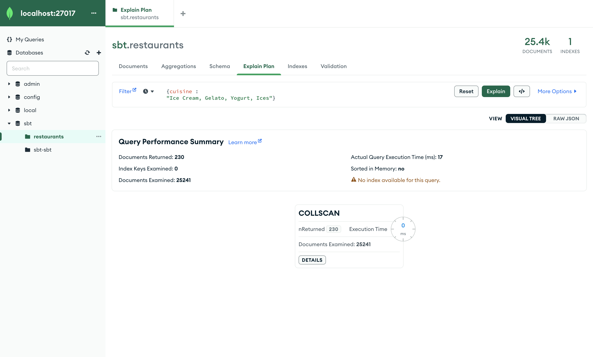

# **Знакомство с MongoDB**

## **Установка** 
Из предложенных способов установки я выбрал установку на локальный компьютер. Выполним следующую команду в терминале:
```bash
brew install mongodb-community@6.0
```
Далее будем работать в GUI MongoDB Compass. Подлючимся к локальному хосту.


## **Создание базы данных**
Создадим базу данных 'sbt' и заполним ее данными по ресторанам, предложенными на сайте https://www.digitalocean.com/community/tutorials/how-to-import-and-export-a-mongodb-database-on-ubuntu-20-04-ru. Использовалась команда 
```bash
sudo mongoimport --db sbt --collection restaurants --file restaurants.json
```
Документы имеют следующую структуру:


## **CRUD операции**
### *Выборка* 
Найдем ресторан полуярной сети бургерных "Wendy'S" в Квинсе.

Найдем пекарни на улице Morris Park Ave.

Найдем отзывы ниже "С" у ресторана "Tov Kosher Kitchen".


### *Обновление данных*
Ресторан "Wendy'S" переехал в соседнее здание


Ресторан "Wendy'S" поменял назвение на "Вкусно и точка"

У ресторана "Terminal Cafe/Yankee Clipper" оставим только положительные отзывы :)


### *Удаление данных*
Удалим лавки с мороженым в Манхэттене 


## **Индексы**
Проведем сравнение производительности запросов без индексов и с ними. Рассмотрим поле "cuisine". Без индекса имеет следующую статистику 

Чтобы найти нужные нам документы, были просмотренны все. Посмотрим, как изменится статистика после создания индекса на это поле
 
Как мы видим, было просмотренно ровно столько документов, сколько нам требовалось. (Так же данную статистику можно посмотреть в mongosh при помощи метода .explain("executionStats")). 

При работе с индексами важно иметь глубокое представление о запросах вашего приложения. Исходя из этого имеет смысл сделать индексы на поля "name", "borough" (город ресторана), "cuisine" (кухня). Возможно имеет смысл создать Compound Index для полей выше, так как часто бывают запросы вида "Бургерные в Москве", "Рестораны Вкусно и точка в Москве". 
