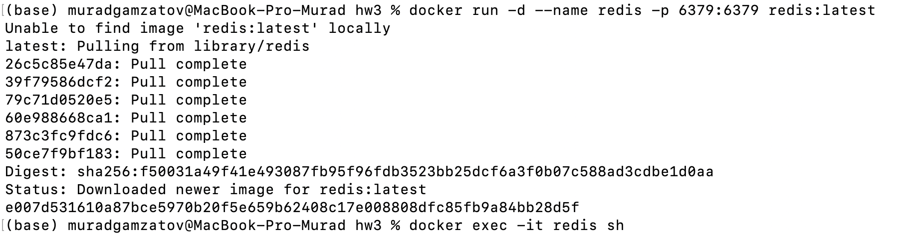
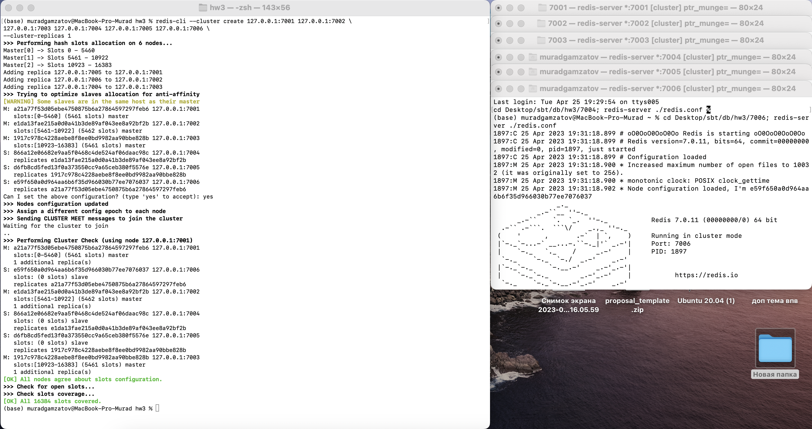
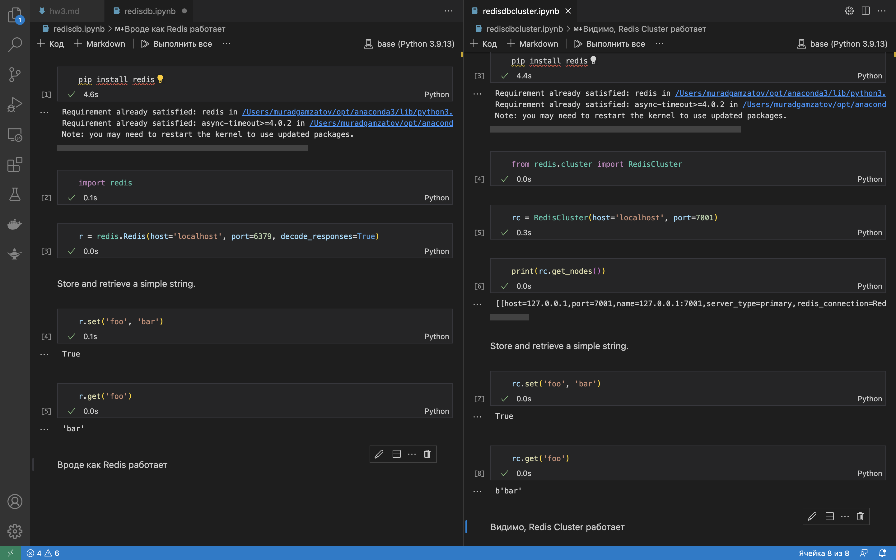
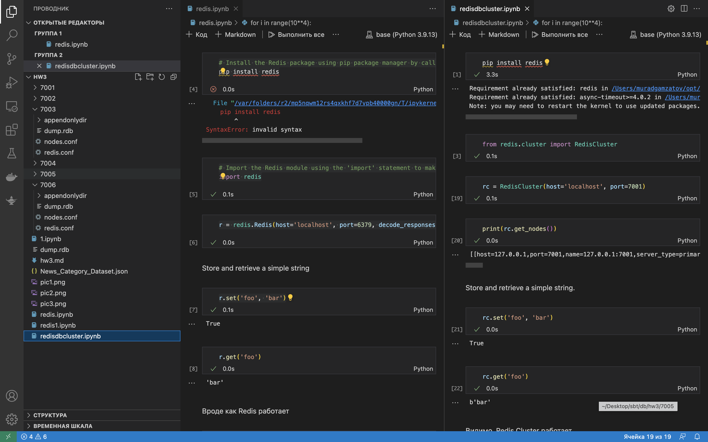
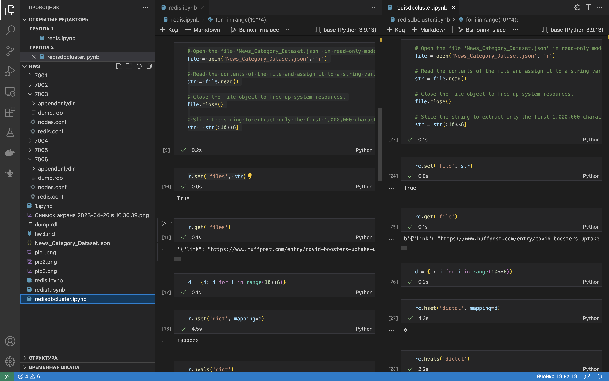
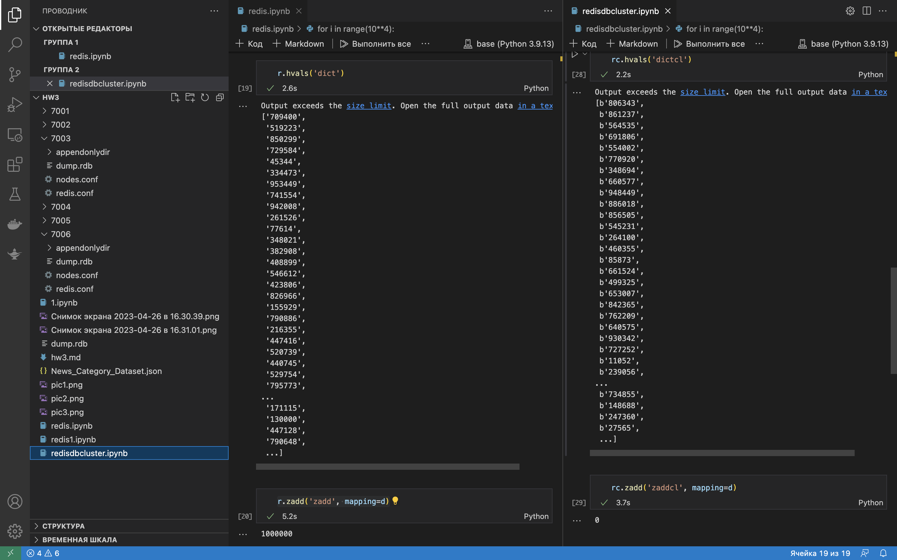
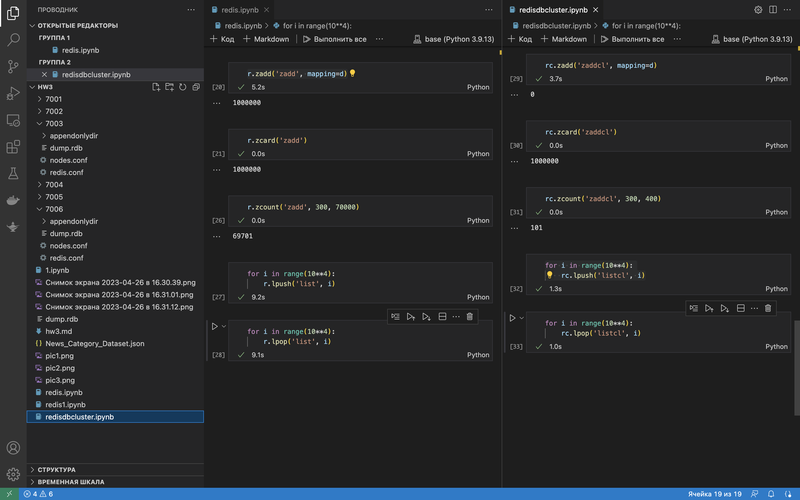

#  Homework #3. Redis
## Run Redis/Redis Cluster
Развернем Redis в Docker:

Разворачивание RedisCluster:

Если мы не хотим создавать Redis Cluster, настраивая и запуская отдельные экземпляры вручную, как показано выше, существует гораздо более простая система (но мы не узнаем столько же деталей работы). 
```bash
create-cluster start
create-cluster create
```
## Test
Здесь мы подключим наше приложение к базе данных Redis.

Напишем несколько запросов с различными структурами Redis и сравним время их выполнения в Redis и Redis Cluster
В качестве большого JSON файла возьмем датасэт с сайта Kaggle (https://www.kaggle.com/datasets/rmisra/news-category-dataset?resource=download).

Сравним время выполнения различных запросов для Redis и Redis Clsuter




Как можем видеть, где то проигрывает Redis, а где то Redis Cluster.
