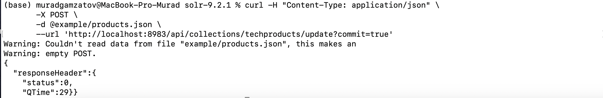

# Homework #4. Solr

## Table of contents 
- [Homework #4. Solr](#homework-4-solr)
  - [Table of contents](#table-of-contents)
  - [История развития Solr](#история-развития-solr)
  - [Инструменты для взаимодействия с Solr](#инструменты-для-взаимодействия-с-solr)
  - [Database engine в Solr](#database-engine-в-solr)
  - [Язык запросов в Solr](#язык-запросов-в-solr)
  - [Распределение файлов БД по разным носителям](#распределение-файлов-бд-по-разным-носителям)
  - [На каких языках программирования написана Solr](#на-каких-языках-программирования-написана-solr)
  - [Идексы в Solr](#идексы-в-solr)
  - [Процесс выполнения запросов в Solr?](#процесс-выполнения-запросов-в-solr)
  - [План запросов в Solr](#план-запросов-в-solr)
  - [Транзкации в Solr](#транзкации-в-solr)
  - [Backup и Restore в Solr](#backup-и-restore-в-solr)
  - [Sharding в Solr](#sharding-в-solr)
  - [Применимость терминов Data Mining, Data Warehousing и OLAP к Solr](#применимость-терминов-data-mining-data-warehousing-и-olap-к-solr)
  - [Методы защиты в Solr](#методы-защиты-в-solr)
  - [Какие сообщества развивают данную СУБД? Кто в проекте имеет права на коммит и создание дистрибутива версий?](#какие-сообщества-развивают-данную-субд-кто-в-проекте-имеет-права-на-коммит-и-создание-дистрибутива-версий)
  - [Демонстрация работы Solr на собственных данных](#демонстрация-работы-solr-на-собственных-данных)
  - [Самостоятельное изучение языка запросов с помощью демобазы.](#самостоятельное-изучение-языка-запросов-с-помощью-демобазы)
  - [Документация и обучение](#документация-и-обучение)
  - [Как быть в курсе происходящего](#как-быть-в-курсе-происходящего)
## История развития Solr
В 2004 году Solr был создан Йоником Сили в CNET Networks в качестве внутреннего проекта для добавления возможности поиска на сайте компании.

В январе 2006 года CNET Networks решила открыто опубликовать исходный код, передав его в фонд Apache Software Foundation. Как и любой новый проект Apache, он вступил в инкубационный период, который помог решить организационные, юридические и финансовые вопросы.

В январе 2007 года Solr вышел из статуса инкубатора в самостоятельный проект верхнего уровня (TLP) и постоянно развивался, наращивая свои возможности, привлекая тем самым пользователей, участников и коммиттеров. Несмотря на то, что Solr был довольно новым публичным проектом, он обеспечил работу нескольких веб-сайтов с высоким трафиком.

В сентябре 2008 года была выпущена версия Solr 1.3, включающая возможности распределенного поиска и улучшения производительности.

В январе 2009 года Йоник Сили вместе с Грантом Ингерсоллом и Эриком Хэтчером присоединился к Lucidworks (ранее Lucid Imagination), первой компании, предоставляющей коммерческую поддержку и обучение для поисковых технологий Apache Solr. С тех пор предложений по поддержке Solr стало много.

В ноябре 2009 года была выпущена версия Solr 1.4. В этой версии были представлены усовершенствования в индексировании, поиске и фасетировании, а также многие другие улучшения, такие как обработка документов (PDF, Word, HTML), кластеризация результатов поиска на основе Carrot2 и улучшенная интеграция с базами данных. Релиз также включает множество дополнительных плагинов.

В марте 2010 года произошло слияние проектов Lucene и Solr. Раздельные загрузки продолжались, но продукты теперь разрабатывались совместно одним набором коммиттеров.

В 2011 году схема номеров версий Solr была изменена, чтобы соответствовать схеме Lucene. После Solr 1.4 следующий релиз Solr был обозначен как 3.1, чтобы сохранить одинаковый номер версии Solr и Lucene.

В октябре 2012 года была выпущена версия Solr 4.0, включающая новую функцию SolrCloud.В 2013 и 2014 годах был выпущен ряд релизов Solr в линейке 4.x, в которых постоянно расширялся набор функций и повышалась надежность.

В феврале 2015 года был выпущен Solr 5.0, первый релиз, в котором Solr упакован как отдельное приложение, прекратив официальную поддержку развертывания Solr как войны. В Solr 5.3 была встроена подключаемая система аутентификации и авторизации.

В апреле 2016 года был выпущен Solr 6.0. Добавлена поддержка выполнения параллельных SQL-запросов через коллекции SolrCloud. Включена поддержка StreamExpression и новый драйвер JDBC для SQL-интерфейса.

В сентябре 2017 года был выпущен Solr 7.0. В этом выпуске, помимо прочего, добавлена поддержка нескольких типов реплик, автомасштабирование и математический движок.

В марте 2019 года был выпущен Solr 8.0, включающий множество исправлений и обновлений компонентов. Узлы Solr теперь могут прослушивать и обслуживать запросы HTTP/2. Имейте в виду, что по умолчанию внутренние запросы также отправляются с использованием HTTP/2. Кроме того, был добавлен вход в администраторский UI с поддержкой BasicAuth и Kerberos. А построение математических выражений в Apache Zeppelin теперь возможно.

В ноябре 2020 года Bloomberg передал Solr Operator проекту Lucene/Solr. Solr Operator помогает развертывать и запускать Solr в Kubernetes.

В феврале 2021 года Solr был создан как отдельный проект Apache (TLP), независимый от Lucene.

В мае 2022 года был выпущен Solr 9.0, как первый релиз, независимый от Lucene, требующий Java 11 и включающий такие основные моменты, как "нейронный" поиск KNN, лучшая модульность, больше плагинов безопасности и многое другое.

## Инструменты для взаимодействия с Solr
Есть несколько инструментов взаимодействия с Solr:
1. Solr CLI. Терминал в Linux/Командная строка в Windows.
2. Solr Admin UI. Solr имеет веб-интерфейс, который обеспечивает онлайн доступ ко многим параметрам и функциям конфигурации Solr.
3. SolrJ. SolrJ, API для работы с Java-приложениями.
4. JavaScript. Клиенты JavaScript.
5. Python. Python и JSON responses.
6. Ruby. Solr с приложениями на Ruby.

## Database engine в Solr
Solr работает как автономный сервер полнотекстового поиска. В его основе лежит поисковая библиотека Lucene Java для полнотекстового индексирования и поиска, а также REST-подобные API HTTP/XML и JSON, которые позволяют использовать его из большинства популярных языков программирования. То есть, Solr является search engine СУБД.

## Язык запросов в Solr
Напишем несколько команд в Solr CLI

Как в системах баз данных данные хранятся в таблицах, в Solr данные хранятся в коллекциях. Коллекцию можно создать следующим образом:

Давайте определим некоторые поля, которые будут содержать наши документы.

Один документ может быть проиндексирован как:

В одном запросе может быть проиндексировано несколько документов:

Файл, содержащий документы, может быть проиндексирован следующим образом:

После того как документы индексируются в коллекцию, они не сразу становятся доступными для поиска. Для того чтобы сделать их доступными для поиска, необходимо выполнить операцию фиксации (также называемую обновлением в других поисковых системах, таких как OpenSearch и т.д.). Коммиты могут быть запланированы на периодические интервалы времени с помощью автокоммитов следующим образом.

Мы можем попробовать поискать в своих документах, например:

## Распределение файлов БД по разным носителям
Solr поддерживает распределение файлов бд по разным носителям, так как построен на проверенном в боях Apache Zookeeper.

## На каких языках программирования написана Solr
Solr написана на языке Java. Она использует в своей основе поисковую библиотеку Lucene, которая тоже написана на Java. 

## Идексы в Solr
Добавляя содержимое в индекс, мы делаем его доступным для поиска в Solr.
Индекс Solr может принимать данные из различных источников, включая файлы XML, файлы с разделенными запятыми значениями (CSV), данные, извлеченные из таблиц в базе данных, и файлы в распространенных форматах, таких как Microsoft Word или PDF.
Вот три наиболее распространенных способа загрузки данных в индекс Solr:
1. Индексирование с помощью Solr Cell и Apache Tika, построенного на базе Apache Tika для ввода бинарных файлов или структурированных файлов, таких как Office, Word, PDF и других проприетарных форматов.
2. Загрузка XML-файлов путем отправки HTTP-запросов на сервер Solr из любой среды, где такие запросы могут быть сгенерированы.
3. Написание пользовательского Java-приложения для получения данных через клиентский API Solr (который более подробно описан в разделе Клиентские API). Использование Java API может быть лучшим выбором, если вы работаете с приложением, например, системой управления контентом (CMS), которая предлагает Java API.
   
Запустим SolrCloud и проиндексируем документы.
Сервер Solr запущен, но он еще не содержит никаких данных, поэтому мы не можем делать никаких запросов.
Solr включает инструмент bin/post для облегчения индексирования различных типов документов. Мы будем использовать этот инструмент для примеров индексирования.

## Процесс выполнения запросов в Solr?
Когда пользователь запускает поиск в Solr, поисковый запрос обрабатывается обработчиком запроса. Обработчик запроса - это подключаемый модуль Solr, который определяет логику, используемую Solr при обработке запроса. Solr поддерживает множество обработчиков запросов. Некоторые из них предназначены для обработки поисковых запросов, другие управляют такими задачами, как репликация индекса.

Для обработки поискового запроса обработчик запроса вызывает парсер запроса, который интерпретирует условия и параметры запроса. Различные парсеры запросов поддерживают разный синтаксис. Парсер запросов по умолчанию в Solr известен как Standard Query Parser, или более распространенный парсер запросов "lucene". Solr также включает парсер запросов DisMax и расширенный парсер запросов DisMax (eDisMax).

Кроме того, существуют общие параметры запросов, принимаемые всеми анализаторами запросов. (Изображенны на картинке)

Входные данные для анализатора запросов могут включать:
+ поисковые строки - то есть термины для поиска в индексе
+ параметры для точной настройки запроса путем увеличения важности определенных строк или полей, применения булевой логики среди поисковых терминов или исключения содержимого из результатов поиска
+ параметры для управления представлением ответа на запрос, например, указание порядка представления результатов или ограничение ответа определенными полями схемы поискового приложения.

Чтобы помочь пользователям найти нужный контент, Solr поддерживает два специальных способа группировки результатов поиска для облегчения дальнейшего поиска: фасетирование и кластеризация.

Фасет - это распределение результатов поиска по категориям (которые основаны на индексированных терминах). Внутри каждой категории Solr сообщает о количестве совпадений с соответствующим термином, который называется ограничением фасета. Фасетное ограничение облегчает пользователям изучение результатов поиска на таких сайтах, как сайты фильмов и обзоры товаров, где существует множество категорий и множество элементов внутри категории.

Кластеризация группирует результаты поиска по сходству, обнаруженному при выполнении поиска, а не при индексировании содержимого. Результаты кластеризации часто не имеют четкой иерархической организации, которая присутствует в результатах фасетного поиска, но, тем не менее, кластеризация может быть полезной. Она может выявить неожиданные общие черты в результатах поиска и помочь пользователям отсеять контент, не относящийся к тому, что они действительно ищут.

Компонент Solr, называемый response writer, управляет окончательным представлением ответа на запрос. Solr включает в себя различные составители ответов, в том числе XML Response Writer и JSON Response Writer.

На приведенной ниже схеме кратко представлены некоторые ключевые элементы процесса поиска.

## План запросов в Solr
Да, в Solr есть план выполнения под названием "explain", который предоставляет подробное описание того, как Solr пришел к результатам поиска по определенному запросу. Функциональность "explain" предназначена для того, чтобы помочь разработчикам понять, почему определенные документы были возвращены для конкретного запроса, и как был применен алгоритм оценки Solr.

Чтобы получить информацию о плане запроса нужно в запросе задать параметр "debug = results".

По умолчанию score explanations  возвращаются в виде больших строковых значений, с использованием новых строк и отступов табуляции для структурирования и удобочитаемости, но можно указать дополнительный параметр debug.explain.structured=true, чтобы вернуть эту информацию в виде вложенных структур данных, соответствующих формату ответа, запрашиваемому wt. (Параметр wt выбирает программу написания ответов, которую Solr должен использовать для форматирования ответа запроса. 
Если вы не определите параметр wt в своих запросах, в качестве формата ответа будет возвращен JSON.
)

## Транзкации в Solr
Solr не является транзакицонной базой данных, поэтому она не поддерживает транзакции в полном смысле этого слова. Commit делает все отложенные изменения всех клиентов видимыми для новых запросов. Аналогично, rollback отменяет все ожидающие изменения всех клиентов. При этом не учитывается, какой клиент отправил команду commit/rollback.

По этой причине обработка ошибок не должна автоматически приводить к rollback. Потому что последствия могут быть гораздо шире, чем просто ошибочные данные. И в результате очистка может быть намного сложнее.

Руководство из документации Solr гласит, что следует использовать autocommit. Это особенно верно при выполнении массовых операций. Если вы выполняете массовое индексирование, возможно, с несколькими параллельными клиентами, то лучше выполнять autocommit каждые несколько раз (или через каждые несколько документов). Это приведет к созданию меньшего количества новых сегментов индекса, и в результате индекс будет менее фрагментированным.

## Backup и Restore в Solr
Solr предоставляет два подхода к резервному копированию и восстановлению ядер или коллекций Solr, в зависимости от того, как вы используете Solr. Если вы используете кластер SolrCloud, вы будете использовать API Collections. Если вы используете user-managed cluster или a single-node installation, вы будете использовать обработчик репликации.

Поддержка резервного копирования в SolrCloud обеспечивается с помощью Collections API. Это позволяет создавать резервные копии на нескольких шардах и восстанавливать их на том же количестве шардов и реплик, что и исходную коллекцию. (Для SolrCloud Backup/Restore требуется общая файловая система, смонтированная по одному и тому же пути на всех узлах, или HDFS.)

В User-Managed Clusters и Single-Node Installations для резервного копирования и восстановления используется обработчик репликации Solr. Из коробки Solr включает неявную поддержку репликации, поэтому можно использовать этот API. Однако конфигурацию обработчика репликации можно настроить, определив свой собственный обработчик репликации в solrconfig.xml. 

Solr предоставляет абстракцию репозитория, позволяющую пользователям создавать резервные копии и восстанавливать данные в различных системах хранения. Например, кластер Solr, работающий на локальной файловой системе (например, EXT3), может хранить резервные копии данных на том же диске, на удаленном сетевом диске, в HDFS или даже в некоторых популярных "облачных хранилищах", в зависимости от выбранной реализации "репозитория". Solr предлагает несколько различных реализаций репозиториев из коробки (LocalFileSystemRepository, HdfsBackupRepository, GCSBackupRepository и S3BackupRepository) и позволяет пользователям создавать плагины для своих собственных систем хранения данных по мере необходимости.
Пользователи могут определить любое количество хранилищ в своем файле solr.xml.

## Sharding в Solr
Рекомендуется использование шардирования в SolarCloud, потому что были устранены следующие ограничения:
1. Разделение индекса на шарды было в некоторой степени ручным.
2. Не было поддержки распределенного индексирования, что означало необходимость явной отправки документов в определенный шард; Solr не мог самостоятельно определить, в какие шарды отправлять документы.
3. Не было балансировки нагрузки или отказоустойчивости, поэтому при большом количестве запросов нужно было решать, куда их отправлять, а если один шард умирал, он просто исчезал.

В SolrCloud нет лидеров и последователей. Вместо этого каждый шард состоит как минимум из одной физической реплики, ровно одна из которых является лидером. Лидеры избираются автоматически, сначала на основе принципа "первый пришел - первый обслужил", а затем на основе процесса ZooKeeper.

Если лидер выходит из строя, одна из других реплик автоматически избирается в качестве нового лидера.
Когда документ отправляется на узел Solr для индексирования, система сначала определяет, к какому шарду принадлежит документ, а затем на каком узле в данный момент находится лидер этого шарда. Затем документ передается текущему лидеру для индексирования, а лидер пересылает обновление всем остальным репликам.

По умолчанию все реплики имеют право стать лидерами, если их лидер выходит из строя. Однако за это приходится платить: если все реплики могут стать лидерами в любое время, каждая реплика должна постоянно синхронизироваться со своим лидером. Новые документы, добавленные в лидер, должны направляться в реплики, и каждая реплика должна выполнять фиксацию. Если реплика выходит из строя или временно недоступна, а затем вновь подключается к кластеру, восстановление может быть медленным, если она пропустила большое количество обновлений.
Эти проблемы не являются проблемой для большинства пользователей. Однако некоторые случаи использования были бы более эффективными, если бы реплики вели себя немного более похоже на прежнюю модель, либо не синхронизируясь в реальном времени, либо вообще не имея права становиться лидерами.
Solr решает эту задачу, позволяя задавать тип реплики при создании новой коллекции или при добавлении реплики. Доступны следующие типы:
1. NRT: Это тип по умолчанию. Реплика NRT (NRT = NearRealTime) ведет журнал транзакций и записывает новые документы в свои индексы локально. Любая реплика этого типа может стать лидером. Традиционно это был единственный тип, поддерживаемый Solr.
2. TLOG: Этот тип реплики ведет журнал транзакций, но не индексирует изменения документов локально. Этот тип помогает ускорить индексирование, поскольку в репликах не нужно фиксировать изменения. Когда реплике этого типа необходимо обновить свой индекс, она делает это путем репликации индекса от лидера. Реплика этого типа также может стать лидером шарда; для этого она сначала обрабатывает свой журнал транзакций. Если она станет лидером, то будет вести себя так же, как если бы это была реплика типа NRT.
3. PULL: Этот тип реплики не ведет журнал транзакций и не индексирует изменения документов локально. Она только копирует индекс от лидера осколка. Она не имеет права стать лидером шарда и вообще не участвует в выборах лидера шарда.

Если вы не укажете тип реплики при ее создании, она будет типа NRT.

## Применимость терминов Data Mining, Data Warehousing и OLAP к Solr
Data Mining, Data Warehousing и OLAP - эти термины обычно используются для описания процессов работы с хранилищами данных, которые  обрабатывают и анализируют большие объемы структурированных данных. Solr - это поисковый сервер на основе Apache Lucene, который предназначен для индексации и поиска текстовой информации в неструктурированных данных.

Хотя некоторые функции Solr могут использоваться для хранения и управления данными, он не является полноценной системой хранилища данных или OLAP-системой. Однако, Solr может использоваться в качестве поисковой системы для данных, которые уже были обработаны и интегрированы в хранилище данных или OLAP-систему. Таким образом, Solr можно использовать в сочетании с другими инструментами для выполнения задач, связанных с Data Mining, Data Warehousing и OLAP.

## Методы защиты в Solr
Solr имеет механизмы безопасности для поддержки аутентификации, авторизации и аудита пользователей. 

Solr включает некоторые плагины из коробки, и дополнительные плагины могут быть разработаны с использованием фреймворков аутентификации, авторизации и аудита.

Все плагины аутентификации, авторизации и регистрации аудита могут работать с Solr независимо от того, работает ли он как кластер или как одноузловая установка. Вся соответствующая конфигурация, включая пользователей и правила разрешения, хранится в файле с именем security.json. При запуске Solr как управляемого пользователями кластера или одноузловой установки этот файл должен находиться в каталоге $SOLR_HOME (обычно server/solr). При использовании SolrCloud этот файл должен находиться в ZooKeeper.

Плагины аутентификации помогают защитить конечные точки Solr путем проверки подлинности входящих запросов. Пользовательский плагин может быть реализован путем расширения класса AuthenticationPlugin.
Плагин аутентификации состоит из двух частей:
1. Компонент на стороне сервера, который перехватывает и аутентифицирует входящие запросы к Solr, используя механизм, определенный в плагине, такой как Kerberos, Basic Auth или другие.
1. Компонент на стороне клиента, т.е. расширение HttpClientConfigurer, который позволяет клиенту SolrJ делать запросы к защищенному экземпляру Solr, используя механизм аутентификации, который понимает сервер.

PKIAuthenticationPlugin обеспечивает встроенный механизм аутентификации, в котором каждый узел Solr является суперпользователем и полностью доверяет другим узлам Solr благодаря использованию инфраструктуры открытых ключей (PKI). Каждый плагин аутентификации может выбрать делегирование всего или некоторого межузлового трафика плагину PKI.
В настоящее время в Solr доступны две версии протокола аутентификации PKI. Для каждого исходящего запроса PKIAuthenticationPlugin добавляет специальный заголовок, который содержит метку времени запроса и имя пользователя. Когда узел получает запрос с этим специальным заголовком, он проверяет сообщение, используя открытый ключ соответствующего узла-источника. Проверка сообщения выполняется только для входящего трафика от других узлов Solr, зарегистрированных в ZooKeeper. Если запрос проходит проверку PKI и временная метка имеет давность менее 5 секунд, то запрос будет считаться доверенным.

Версия 2 протокола является версией по умолчанию. В этой версии заголовок SolrAuthV2 содержит: имя узла-источника, имя пользователя, метку времени запроса и base64-кодированную подпись RSA. Все узлы будут пытаться сначала проверить этот заголовок.

Также Solr может шифровать соединения с клиентами и между узлами в режиме SolrCloud с помощью шифрования Secure Sockets Layer (SSL).

## Какие сообщества развивают данную СУБД? Кто в проекте имеет права на коммит и создание дистрибутива версий? 
Инструкции по внесению вклада в развитие Solr находятся на GitHub вместе с кодом Solr здесь: https://github.com/apache/solr/blob/main/CONTRIBUTING.md.

Можно также связаться с сообществом для получения дополнительной помощи, используя различные каналы здесь: https://solr.apache.org/community.html.

## Демонстрация работы Solr на собственных данных
Скачаем пару JSON файлов с Kaggle и создадим свою коллекцию, проиндексировав документы

Добавим еще один JSON файл

Найдем какой нибудь документ

## Самостоятельное изучение языка запросов с помощью демобазы. 
В документации Solr описана учебные Techproducts Data и Films Data и также есть специально разработанный для него конфицурационный файл sample_techproducts_configs.

## Документация и обучение
Найти документацию и пройти небольшой tutorial можно по ссылке https://solr.apache.org/guide/solr/latest/index.html

## Как быть в курсе происходящего
Чтобы быть в курсе происходящего можно мониторить раздел News или повзаимодействовать с другими людьми по ссылкам в разделе Community на официальном сайте https://solr.apache.org
